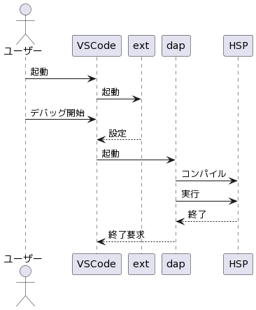
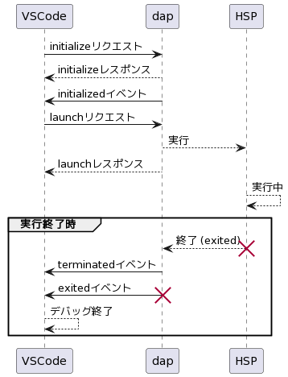
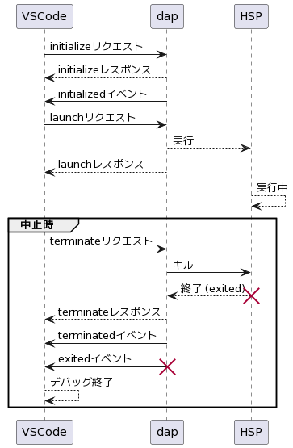

# 開発者向けのドキュメント

このドキュメントには拡張機能の開発のための補足的な情報を記します

- [開発環境の構築手順](#開発環境)
- [前提知識](#前提知識)
- [システムの構造](#システムの構造)
- [動作の流れ](#動作の流れ)
- [おまけ](#おまけ)
- [参考リンク](#参考リンク)

## 開発環境

この拡張機能の開発環境を構築する手順は以下の通りです

- [Node.js] をインストールしてください
    - バージョンはLTS版が推奨です

PowerShell でこのディレクトリを開き、次のコマンドを実行します

```pwsh
npm ci
```

開発中の拡張機能のインストール・アンインストールは次のスクリプトを使用します

```pwsh
# インストール
./install.ps1
```

```pwsh
# アンインストール
./uninstall.ps1
```

## 前提知識

次について知っておくとよいです

- [Node.js], npm (JavaScript実行環境、パッケージマネージャ)
- [TypeScript] (使用言語)
- [VSCode] の拡張機能API
- [Debug Adapter Protocol] (DAP)
- [Powershell] (`pwsh`)

### 難しさ

前提知識が非常に多くなっています。

実際のところ作者 (@vain0x) も多くは把握していません。
公式ドキュメントとの食い違いがあれば、おそらくそちらが正しいです (教えてもらえると助かります)

### VSCodeのデバッグ機能について

- (VSCodeの機能) VSCodeには「**デバッグ**」という、その名の通りプログラムをデバッグするための機能があります
    - 既定では、F5キーは「デバッグの開始」コマンドに割り当てられています
- (VSCodeの用語) VSCodeはタブに含まれるエディタ部分のことを **テキストエディタ** と呼んでいます
- (DAPの用語) VSCodeから起動されて、デバッグ実行するプログラムの管理を担当するプロセスを **デバッグアダプタ** (debug adapter) といいます

```
    VSCode ---> デバッグアダプタ ---> HSP
```

## システムの構造

この拡張機能はいくつかのプログラムに分かれています

TypeScriptで書かれたプログラムが2つあります:

- VSCodeの拡張機能 (`ext` と表記)
- デバッグアダプター (`dap` と表記)

また、HSPスクリプトのコンパイル・実行のためにビルダーというプログラムを用意しています:

- [dist/builder.hsp](dist/builder.hsp) (スクリプト)
- [dist/builder.md](dist/builder.md) (説明)

## 動作の流れ

この拡張機能を使ったデバッグ実行は次の流れで動作します:



拡張機能の起動:

- 一定の条件を満たしたとき、VSCodeが **ext (拡張機能) を起動** する

デバッグの開始:

- HSPのスクリプトを編集しているときに「**デバッグを開始**」(F5)を行う
- デバッグを開始すると、VSCodeが **dap (デバッグアダプタ) を起動** する
- デバッグアダプタがスクリプトを **コンパイル・実行** する

デバッグの終了:

- HSPのスクリプトの実行が終了したとき、またはデバッグUIで中止ボタンが押されたとき、デバッグが終了する

(図には書かれていませんが、HSPのスクリプトの実行が終了したときだけではなく、VSCodeのデバッグUIで中止ボタンが押されたときにも終了処理があります)

### 詳細

「動作の流れ」の各部分を詳しく説明します

### 拡張機能の起動条件

VSCodeを開いたとき、インストール済みの拡張機能は必ずしも起動されません。
いつ起動するかは拡張機能に指定されている **[アクティベーションイベント]** によって決まります

アクティベーションイベントは、その拡張機能を起動すべきタイミングや条件の設定です。
その指定されたタイミングになったときや条件を満たしたときに、拡張機能が起動します

この拡張機能のアクティベーションイベントは `package.json` の `activationEvents` に書かれています:

- HSPのファイルが開かれたとき (onLanguage:hsp3)
- ユーザーがデバッグを開始しようとしたとき (onDebug)

### 拡張機能のエントリーポイント

拡張機能が起動すると `extension.ts` のactivate関数が呼ばれます

### 拡張機能による設定の提供

VSCodeがデバッグを開始するとき (= F5)、デバッグ設定プロバイダー ([DebugConfigurationProvider]) によって **設定の解決** (resolve) と呼ばれる処理が行われます

「設定の解決」はVSCodeがデバッグを開始するために必要な情報を決定する処理です。
VSCodeはデバッグのためにデバッグアダプタを起動したいのですが、この時点ではデバッグアダプタの起動方法や、起動時に渡すべきオプションが確定しているとはかぎりません

デバッグ設定の詳細はいくつかの場所をみる必要があります:

- (このリポジトリの) `package.json`
    - `contributes.debuggers[0]` の値
    - [詳細](https://code.visualstudio.com/api/extension-guides/debugger-extension#anatomy-of-the-package.json-of-a-debugger-extension)
- (ワークスペース内の) `launch.json`
    - デバッグを開始しようとしているVSCodeが開いているディレクトリに `.vscode/launch.json` という設定ファイルがある場合、その内容が使用されます
- デバッグ設定プロバイダーが指定する値
    - 詳細は `MyConfigurationProvider` の実装を参照してください

### DAPの流れ

dap (デバッグアダプタ) が起動された後の流れを説明します。
動作の流れはDAPの仕様の通りです。
ただし、必要な部分に簡略化して記しています

図:

<div style="display: flex">

<div style="margin-inline: 3%; border-right: 2px solid #bdbdbd"></div>

</div>

(終了時の挙動が2パターンあります)

はじめに、VSCodeから `initialize` と `launch` リクエストが送られてきます。
`launch` リクエストのパラメーターには、前述のデバッグ設定の内容が含まれます。
これを利用して、デバッグの対象となるHSPスクリプトをコンパイル・実行します
(コンパイル・実行の詳細はビルダーを参照)

HSPスクリプトが実行されたら、そこからは標準のスクリプトエディタの場合と同様に、デバッグウィンドウが表示されます

デバッグを終了するときの動きを述べます。
デバッグの終了は2パターンあります:

- (実行終了) HSPのプロセスがend命令や閉じるボタンで終了するケース
- (中止) VSCodeのデバッグUIの中止ボタンが押されるケース

実行終了のパターンでは、デバッグアダプタがHSPのプロセスの終了を検出します。
そのときにVSCodeに対して `terminated` イベントと、`exited` イベントを送ります

中止ボタンのパターンでは、デバッグアダプタがHSPのプロセスを直接キルし、前述のイベント2つを送ります

### 余談: terminated/exitedイベントの違い

この拡張機能ではこれらの2つのイベントの区別は気にしなくてよいです

`terminated` イベントはデバッグセッションが終わることを表し、`exited` イベントはデバッグの対象となるプロセスが終了したことを表します。
この拡張機能はデバッグのたびに新しいプロセスを起動しますが、デバッガーによっては実行中のプロセスに接続 (attach) してデバッグするものもあります。
その場合、terminatedはデバッグ対象のプロセスが終了したことを意味しません

---

## 拡張機能の登録

`package.json` はnpmの設定ファイルですが、VSCodeの拡張機能の情報も書かれています

以下のプロパティが重要なはたらきをします:

- `activationEvents`: 拡張機能が有効になるタイミング・条件を指定する
    - `onLanguage:hsp3`: 言語が「hsp3」であるテキストエディタを開いたとき
    - `onDebug`: ユーザーがデバッグ機能を利用するとき
- `main`: 拡張機能のエントリーポイント (入口) を指定する
    - 拡張機能が有効になったとき、ここで指定したファイル (JavaScript) の `activate` という関数が実行される
- `contributes`: 拡張機能のコントリビューションポイント (拡張機能がどういう機能を提供するのかを明示するもの)
    - `languages`: 言語の種類を増やすことを表している
        - ここでは `.hsp` という拡張子が `hsp3` という名前の言語だと認識してほしい、という指定をしている
        - 他の拡張機能に同様の指定があるとき、同じ言語だと認識されている (はず)
    - `configuration`: 拡張機能ごとの設定項目を指定している。
        ここで指定した設定項目は、VSCodeの設定ファイル (`settings.json`) に書ける
    - `debuggers`: 拡張機能がデバッグ機能を提供することを指定している
        - `runtime`, `program`: デバッグを開始する際に、デバッグアダプタを起動する方法を指定している
            - `"runtime": "node"` はデバッグアダプタがNode.jsによって実行できることを指定している
            - `program`: そのエントリーポイントとなるJavaScriptのファイルを指定している

---

## おまけ

この拡張機能に特有ではない予備知識を記します

### おまけ: 文字コード

[HSP3 文字列のひみつ](https://www.onionsoft.net/hsp/v36/doclib/hsp3str.htm) を読んでおくとよいでしょう

- (おことわり) ここでは日本語圏でよく使われる文字だけを **文字** と呼ぶ。それ以外のものは無視する
- (符号化文字集合・文字コードとは) 文字に番号を振って、文字列を数列で表現できるとコンピュータで扱いやすい。
    文字と番号の対応づけのことを **符号化文字集合** (coded character set) という。
    文字に割り振られた数値を **文字コード** (character code) という
    - UTF-8とUTF-16は、どちらも同じ符号化文字集合を使うので、文字コードは同じ
- (エンコーディングとは) 文字列を文字コードからなる数列で表したとき、その数列をバイト列に対応付ける方法を「エンコーディングスキーム」(encoding scheme; 符号化方式)、略して **エンコーディング** という
    - UTF-8, UTF-16, shift_jis などのエンコーディングがある
- (ANSIとは) Windowsでは、UnicodeではないマルチバイトのエンコーディングのことをANSIと呼んでいるように思える
    - ANSIコードページというものをOS側で設定できて、それがどのエンコーディングを指すかは変更できる
    - 日本語版のWindowsでは、ANSIコードページはshift_jisと同じになっている
    - 参考:[コード ページ - Win32 apps | Microsoft Docs](https://docs.microsoft.com/ja-jp/windows/win32/intl/code-pages)

### おまけ: プロセス

- (プロセスとは) `*.exe` などの実行ファイルを実行することで生成される、「動作しているプログラム」のことを **プロセス** (process) という
- (子プロセスとは) プロセスが他の実行ファイルを起動することがある。そのとき生成されるプロセスを **子プロセス** (child process) という
- (パイプとは) **パイプ** というのがあって、これはデータの通信路のようなもの
    - 手短では説明しがたいので、詳しくは調べてほしい
    - プロセス間でデータを送受信するときによく使う
- (標準入出力とは) プロセスは起動した時点で、標準入力(stdin)、標準出力(stdout)、標準エラー(stderr)という3つのパイプが接続されている
    - 標準入力からはデータを読めて、標準出力と標準エラーにはデータを書ける
    - プロセス間でデータを送受信するときによく使う
    - コマンドライン版のHSP (`hsp3cl`) の `mes` 命令は標準出力に文字列を書く
- (終了コード) プロセスが終了する際に **終了コード** (exit code) という番号を1つ指定する
    - 正常に完了したかエラーが起こったのか、といった付加的な情報を伝えるのに使われる
    - 0は成功、0以外は失敗

### おまけ: Debug Adapter Protocol (DAP)

- (用語) デバッグ実行されているプロセスを **デバッギ** (debuggee)という

DAPについて:

- VSCodeとデバッギの間の仲介役として、**デバッグアダプタ** (debug adapter) というプログラムがある
    - VSCodeは特定の言語(HSP)をデバッグ実行する方法を知らない
    - デバッグアダプタはデバッグの開始時に起動される
    - VSCodeは「デバッギを起動せよ」といった指示をデバッグアダプタに送る
        - デバッグアダプタはVSCodeから来た指示を解釈して、デバッギを起動するための具体的な処理を行う
        - これにより、VSCodeが特定の言語の事情を知ることなく、デバッグUIが動く
    - 逆に、デバッグアダプタからVSCodeに指示を出すこともできる
        - 例えばデバッギが自発的に終了したとき、デバッグアダプタがVSCodeに「デバッギが終了した」ことを通知することで、VSCodeはデバッグの終了を認識できる
    - VSCode (などの開発ツール) とデバッグアダプタの間のやりとりを定めた仕様を Debug Adapter Protocol (**DAP**) という
        - デバッグアダプタに対してどのような指示を送れるか、あるいはどういう指示が送られてくるか、指示をどのように送受信するかということが決められている

DAPの実装は `@vscode/debugadapter` というライブラリを使っている

### おまけ: HSP3のプログラムの実行

- HSPのスクリプトのコンパイルと実行は、次のように2段階になっている
- スクリプトからオブジェクトファイルを作る
    - オブジェクトファイルは `obj` または `*.ax` という名前のファイルに保存される
    - オブジェクトファイルの内容は、意味的にはもとのスクリプトと同じだが、実行しやすいように整理されている
- オブジェクトファイルをランタイムに渡す。ランタイムがその内容を実行する
    - ランタイムは `hsp3.exe` (通常版), `hsp3cl.exe` (コマンドライン版), runtimeディレクトリの下にある `hsp3utf.exe` (UTF-8版) など

## その他

- **Node.js**: JavaScriptの実行環境。JavaScriptのランタイムである **V8** に、ファイルの読み書きなどの機能を組み込んで提供しているもの
- **TypeScript**: JavaScriptに型システムを加えた言語。
    - コンパイルするとJavaScriptに変換される
    - 設定ファイル: `tsconfig.json`
- **Webpack**:
    - 複数のJavaScriptのファイルをまとめて1つのファイルにするツール
    - 設定ファイル: `webpack.config.js`
    - `ts-loader` というプラグインが内部的にTypeScriptのコンパイラを呼び出して、コンパイルを行うように設定している
- VSCodeの「タスク」機能を使って、スクリプトを実行することもできる。F5キーに割り当てられているほうが都合がいいので、それは使わなかった
- VSCodeのデバッグUIにある、中止ボタン以外の機能を使えるようにするには、デバッグアダプタとデバッギの間で追加の通信が必要になる
    - デバッグアダプタが必要な情報をデバッギから取り出したりデバッギに指示を送る方法が用意されているわけではないので難しい
    - デバッガ (hsp3debug) もカスタマイズすれば可能ではあるはず

## 参考リンク

VSCodeのドキュメント:

- [Debugging in Visual Studio Code](https://code.visualstudio.com/docs/editor/debugging)
    - デバッグ機能の使いかた
- [Contribution Points | Visual Studio Code Extension API](https://code.visualstudio.com/api/references/contribution-points)
    - 拡張機能の package.json に書く内容のドキュメント
- [Built-in Commands | Visual Studio Code Extension API](https://code.visualstudio.com/api/references/commands)
    - コマンド機能のドキュメント
- [Debugger Extension](https://code.visualstudio.com/api/extension-guides/debugger-extension)
    - デバッグ機能を提供する拡張機能の作り方のガイド


[Node.js]: https://nodejs.org
[TypeScript]: https://www.typescriptlang.org
[VSCode]: https://code.visualstudio.com
[Debug Adapter Protocol]: https://microsoft.github.io/debug-adapter-protocol/
[Powershell]: https://learn.microsoft.com/ja-jp/powershell/scripting/overview?view=powershell-7.3

[アクティベーションイベント]: https://code.visualstudio.com/api/references/activation-events
[DebugConfigurationProvider]: https://code.visualstudio.com/api/extension-guides/debugger-extension#using-a-debugconfigurationprovider
